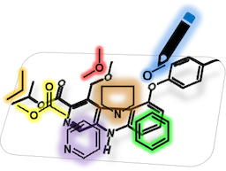

# Chemotype Editor

The Chemotype Editor is a graphical user interface (GUI) application for creating and editing chemotypes. Substructures and patterns can be sketched using a molecular editor or imported from an external file. Atoms, bonds, molecular annotations, and properties can be added through the GUI application. Edited chemotypes can be saved in the XML-based Chemical Subgraphs and Reactions Mark-up Language (CSRML) and used as structural alerts or chemical fingerprints.

This repository houses the source code for the web-based Chemotype Editor and provides a downloadable standalone Windows executable for convenient use.

Access the web application directly from your browser by navigating to the following link: 
https://mn-am.github.io/chemotype-editor/web-app/chemotype-editor

To obtain the standalone Windows executable, head to the release section of this repository and download the latest executable file.

Please note, this implementation of the Chemotype Editor is preliminary. This version does not support reactions, physicochemical properties of atoms, bonds, and molecules, additional substructures exceptions, and inclusions. Although the CSRML format can handle multiple chemotypes, the editor is limited to a single chemotype at a time. The editor can import substructure defined in SMARTS format using copy & paste. However, SMARTS recursive fragments and reactions are not supported.

## ChemoTyper application

ChemoTyper is a graphical user interface (GUI) application for for searching, matching, and highlighting chemotypes in chemical datasets. Please visit the [ChemoTyper repository](https://github.com/mn-am/chemotyper) on GitHub.

## References

*   [​C Yang, A Tarkhov, J Marusczyk, B Bienfait, J Gasteiger, T Kleinoeder, T Magdziarz, O Sacher, CH Schwab, J Schwoebel, L Terfloth, K Arvidson, A Richard, A Worth, J Rathman. New Publicly Available Chemical Query Language, CSRML, To Support Chemotype Representations for Application to Data Mining and Modeling. *J. Chem. Inf. Model.* **2015**, *55(3)*, 510-528.](http://pubs.acs.org/doi/abs/10.1021/ci500667v)

## Contact

For technical support please contact [​support@mn-am.com](mailto:support@mn-am.com).

## Acknowledgements

The ChemoTyper application was developed by Molecular Networks GmbH, Erlangen, Germany under a contract from the U.S. FDA Center for Food Safety and Applied Nutrition (CFSAN), Office of Food Additive Safety.

The XML-based substructure (or chemotype) definition language CSRML was co-developed in collaboration with Altamira LLC, Columbus, OH, USA.

The development of the Chemotype Editor application received funding from the Innovative Medicines Initiative 2 Joint Undertaking under Grant Agreement No 777365 ([​eTRANSAFE project](https://etransafe.eu/)) and the Cosmetics Europe Ontology project.

Visit the [​website](https://www.mn-am.com) of Molecular Networks GmbH and Altamira LLC.
